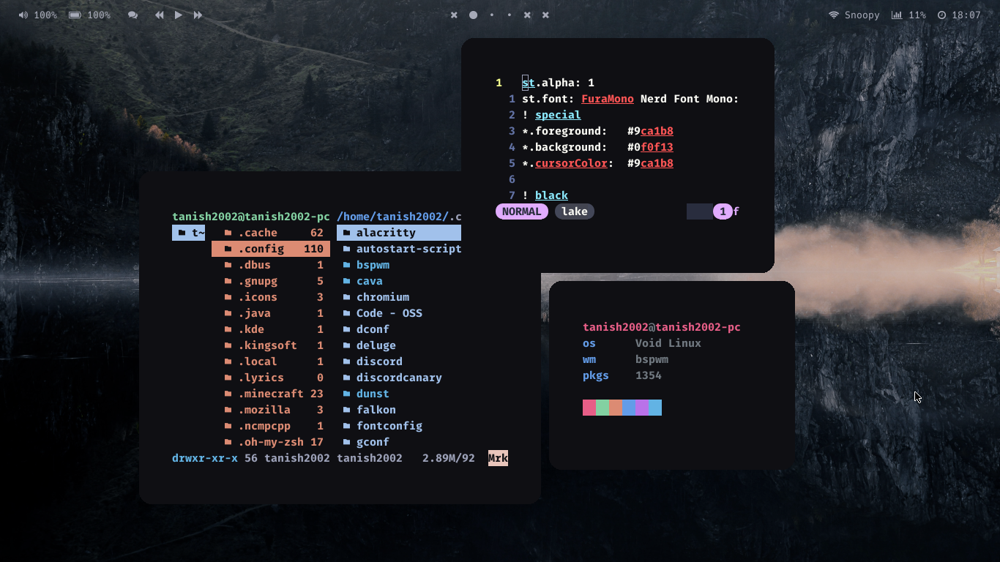

# My Mostly Stolen Dots

## Details


* **OS:** Bedrock Linux {Void + Arch}
 
* **WM:** bspwm, i3-gaps
 
* **Terminal:** [st](https://gitlab.com/Tanish2002/st-tanish2002)

*  **File Manager:** Ranger for Terminal, Dolphin for GUI
 
* **Terminal Font:** Hack Nerd Font Mono, FuraCode Nerd Font Mono Bold
 
* **Shell:** zsh
 
* **Bar:** polybar
 
* **Compositor:** Picom
 
## Previews

## i3-gaps: Mountains

### Info
##### Color Scheme is pretty much Fixed
##### What's on Screen: Polybar, feh, ufetch, cava
Credit: [Vista1nik](https://github.com/Vista1nik/i3-mountains)


## Bspwm: Pywal


### Info
##### Color Scheme is Changable Using Pywal, Most of The wallpapers in my [Wallpapers](https://gitlab.com/Tanish2002/dot-files/-/tree/master/Wallpapers%2FWallpapers) Folder <br />
##### What's on Screen: Polybar, pfetch
Credit: Me :) 

## Bspwm: Tea

### Info
##### Color Scheme is Made by [me](https://gitlab.com/Tanish2002/dot-files/-/blob/master/Bspwm/mytheme1)
##### What's on Screen: Polybar, pfetch
Credit: Me again :) 

## Bspwm: Lake


### Info
##### Color Scheme is Made by [me](https://gitlab.com/Tanish2002/dot-files/-/blob/master/Bspwm/mytheme1)
##### What's on Screen: Polybar, pfetch, neovim, Ranger
Credit: Meeeee 

## Installation

### **Clone my repo**
```
$ cd
$ git clone https://gitlab.com/Tanish2002/dot-files
$ cd dotfiles
``` 

### **Use stow**
```
$ stow <WM-Name> -t ~/
$ stow Wallpapers -t ~/
$ stow bin -t ~/

Do basic stuff like using pywal or xrdb and adding bin to $PATH
```

### **And Voilla That's All!!**`

### Some More Info
**For helpful scripts Check Out:** [bin](https://gitlab.com/Tanish2002/dot-files/-/tree/master/bin%2Fbin) <br />
**For My build of st:**[Here](https://gitlab.com/Tanish2002/st-tanish2002)
