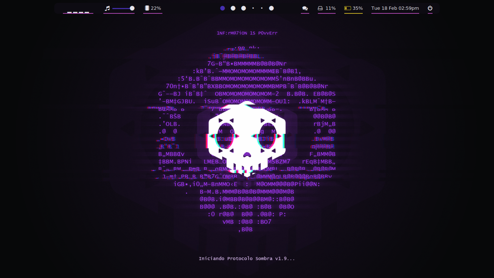

# My Mostly Stolen Dots

## Details


* **OS:** Manjaro Linux
 
* **WM:** bspwm, i3-gaps
 
* **Terminal:** Kitty

*  **File Manager:** Ranger for Terminal, Thunar for GUI
 
* **Terminal Font:** Fira Code Mono
 
* **Shell:** zsh
 
* **Bar:** polybar
 
* **Compositor:** Sdhand-Compton
 

| **Bspwm** | **i3-gaps** |
| ------ | ------ |
|  <br> <h5>Color Scheme is Changable Using Pywal</h5> |  <br> <h5>Color Scheme is pretty much Fixed</h5> |
  


## Installation

### **Clone my repo**
```
$ cd
$ git clone https://gitlab.com/Tanish2002/dot-files
$ cd dotfiles
``` 

### **Use stow**
```
$ stow <WM-Name> -t ~/
$ stow Wallpapers -t ~/
$ stow bin -t ~/
```
### **And Voilla That's All!!**`
