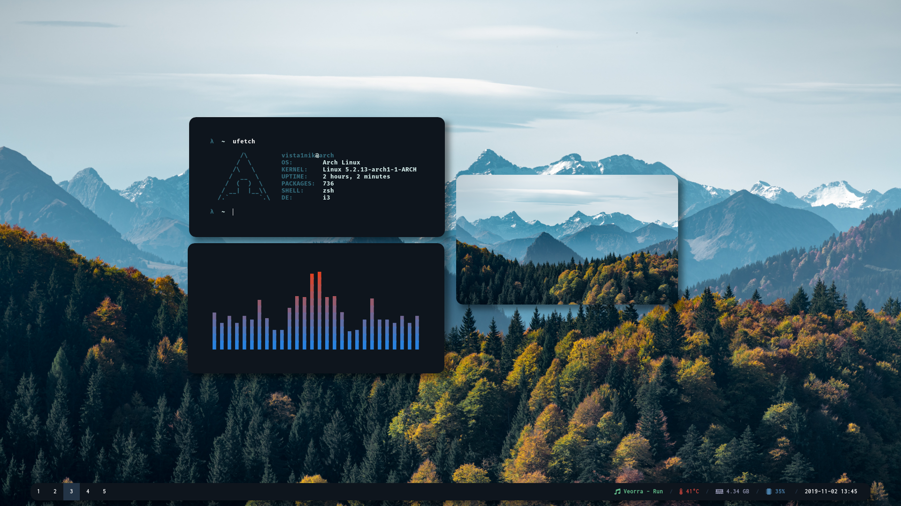
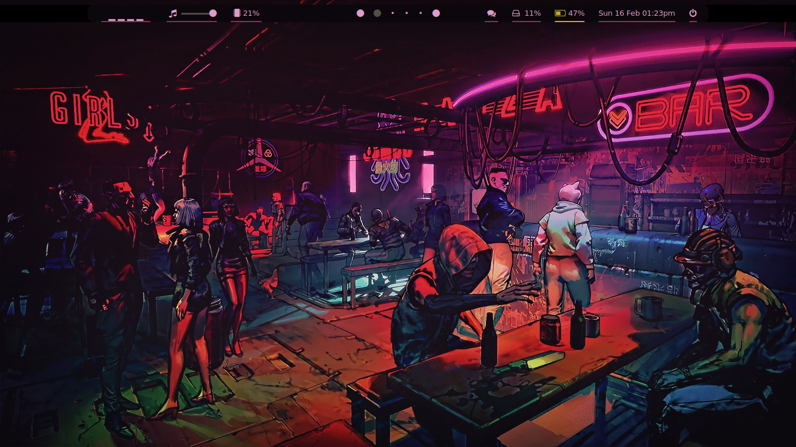
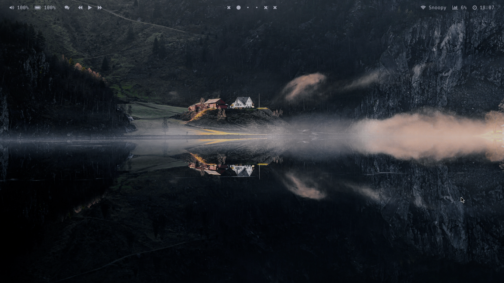
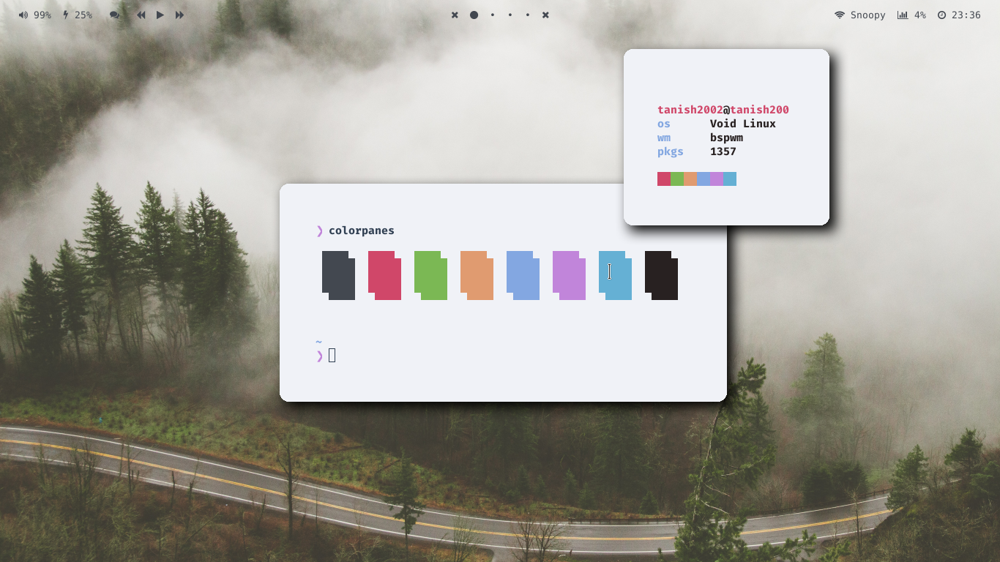
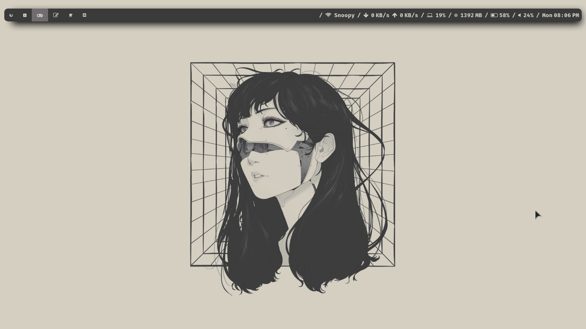
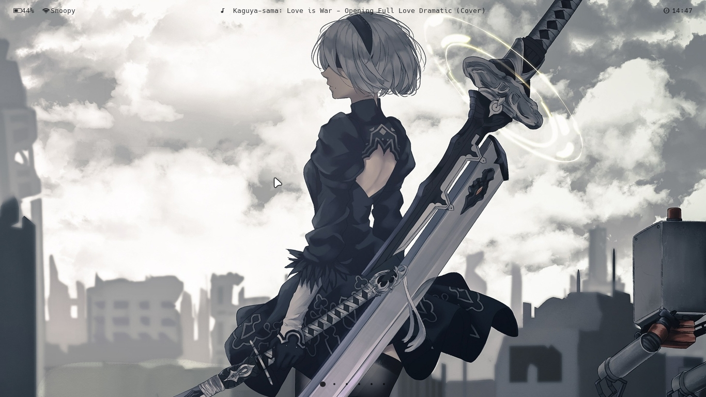
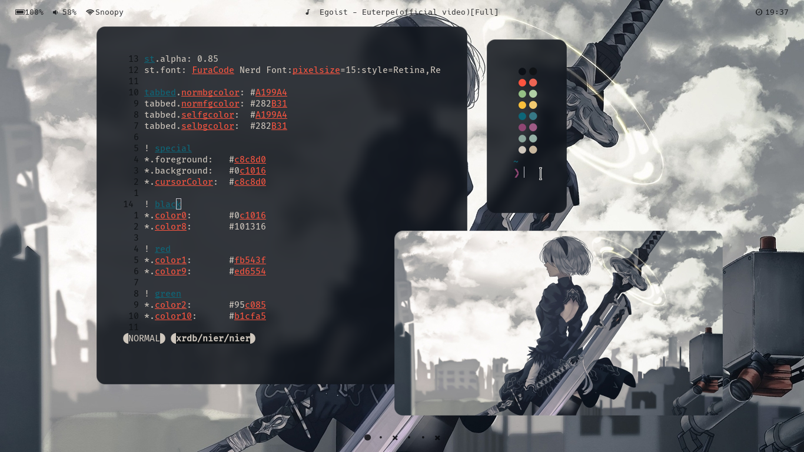
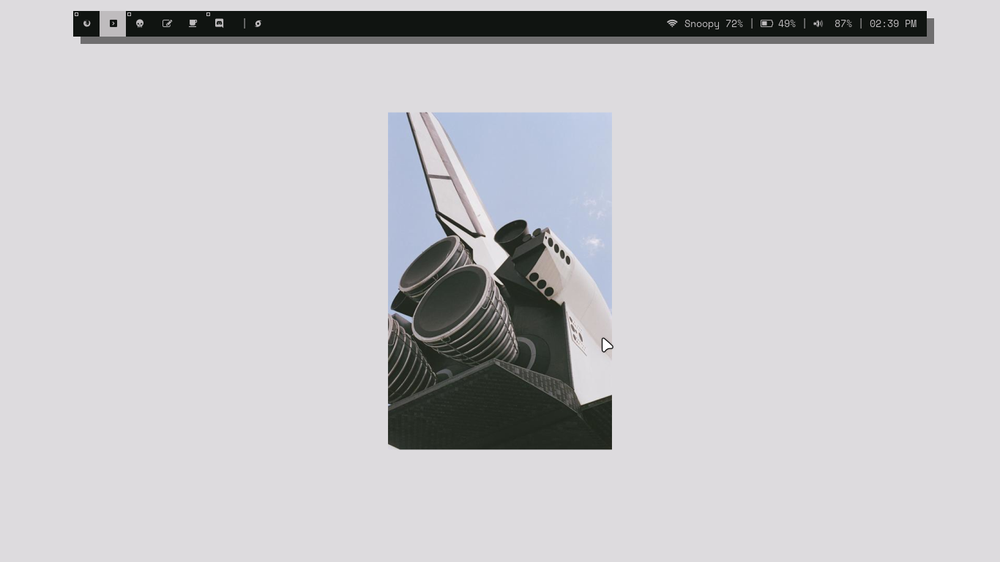
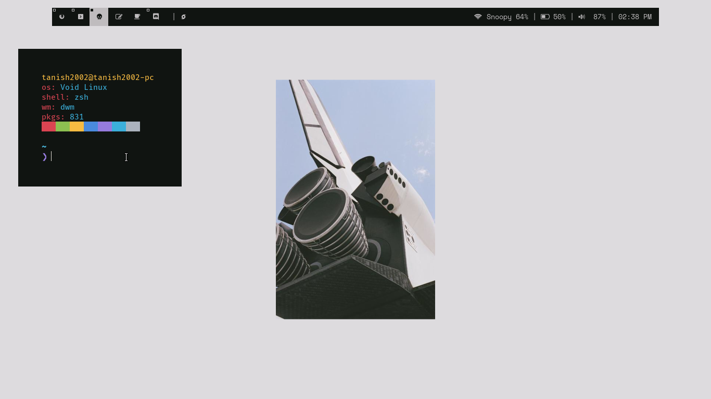

# My Mostly Stolen Dots
## Details


* **OS:** Bedrock Linux {Void + Arch}
 
* **WM:** bspwm, i3-gaps, [dwm](https://gitlab.com/Tanish2002/dwm-tanish2002)
 
* **Terminal:** [st](https://gitlab.com/Tanish2002/st-tanish2002)

*  **File Manager:** Ranger for Terminal, Dolphin for GUI
 
* **Terminal Font:** Hack Nerd Font Mono, FuraCode Nerd Font Mono Bold
 
* **Shell:** zsh
 
* **Bar:** polybar
 
* **Compositor:** [ibhagwan's Picom](https://github.com/ibhagwan/picom)
 
## Previews

## i3-gaps: Mountains

### Info
##### Color Scheme is pretty much Fixed
##### What's on Screen: Polybar, feh, ufetch, cava
Credit: [Vista1nik](https://github.com/Vista1nik/i3-mountains)


## Bspwm: Pywal



### Info
##### Color Scheme is Changable Using Pywal, Most of The wallpapers in my [Wallpapers](https://gitlab.com/Tanish2002/dot-files/-/tree/master/Wallpapers%2FWallpapers) Folder <br />
##### What's on Screen: Polybar, pfetch
Credit: Me :) 

## Bspwm: Tea

### Info
##### Color Scheme is Made by [me](https://gitlab.com/Tanish2002/dot-files/-/tree/master/xrdb%2Fxrdb)
##### What's on Screen: Polybar, pfetch
Credit: Me again :) 

## Bspwm: Lake


### Info
##### Color Scheme is Made by [me](https://gitlab.com/Tanish2002/dot-files/-/tree/master/xrdb%2Fxrdb)
##### What's on Screen: Polybar, pfetch, neovim, Ranger
Credit: Meeeee 

## Bspwm: Forest


### Info
##### Color Scheme is Made by [me](https://gitlab.com/Tanish2002/dot-files/-/tree/master/xrdb%2Fxrdb)
##### What's on Screen: Polybar, pfetch, colorpanes script
Credit: ME   //I don't Steal Now a days 

## Dwm: Girl


### Info
##### Color Scheme is Made by [me](https://gitlab.com/Tanish2002/dot-files/-/tree/master/xrdb%2Fxrdb)
##### What's on Screen: Polybar(coz Dwm Bar ugly), pfetch
Credit: ME 

## Bspwm: Nier


### Info
##### Color Scheme is Made by [me](https://gitlab.com/Tanish2002/dot-files/-/tree/master/xrdb%2Fxrdb)
##### What's on Screen: Polybar, neovim, [balls](bin/bin/balls), feh
Credit: ME 

## Dwm: Solid


### Info
##### Color Scheme is Made by [me](https://gitlab.com/Tanish2002/dot-files/-/tree/master/xrdb%2Fxrdb)
##### What's on Screen: Dwm Bar, [shitfetch](bin/bin/shitfetch)
Credit: ME 

## Installation

### **Clone my repo**
```
$ Sudo xbps-install -S git                                  // Use ur distro's command to install Git
$ git clone https://gitlab.com/Tanish2002/dot-files
$ cd dotfiles/
``` 

### **Use stow**
```
$ Sudo xbps-install -S stow                                // Use ur distro's command to install GNU-stow
$ stow <WM-Name> -t ~/
$ stow xrdb -t ~/
$ stow Wallpapers -t ~/
$ stow bin -t ~/

Do basic stuff like using pywal or xrdb and adding bin to $PATH
```

### **And Voilla That's All!!**`

## Uninstallation
```
$ cd dot-files/
$ stow -D <WM-Name>
$ stow -D xrdb
$ stow -D Wallpapers
$ stow -D bin
$ cd ..
$ rm -rf dot-files/
$ sudo xbps-remove -R stow git                                // Use ur distro's command to uninstall GNU-stow and git
```

### Some More Info
**For helpful scripts Check Out:** [bin](https://gitlab.com/Tanish2002/dot-files/-/tree/master/bin%2Fbin) <br />
**For My build of st:**[Here](https://gitlab.com/Tanish2002/st-tanish2002)

##### Here is a example of me...changing my Themes

