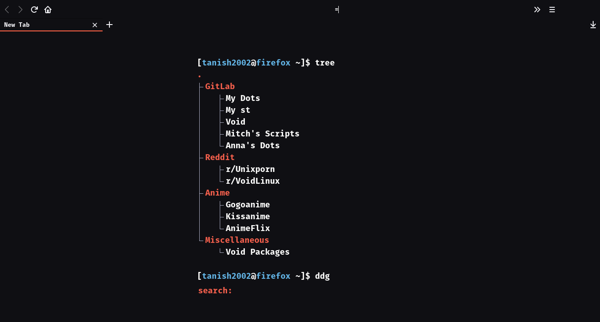

## A basic term-like startpage with tree structure



### For using it in Firfox follow the following steps -:

* Make a file called `enable-autoconfig.js` in `/usr/lib/firefox/browser/defaults/preferences`
  add this to that file:-
```
// enable autoconfig
    pref("general.config.sandbox_enabled", false);

pref("general.config.filename", "autoconfig.cfg");
    pref("general.config.obscure_value", 0);
```

* Make `autoconfig.cfg` in `/usr/lib/firefox`
  and add this to it:-

```
// set new tab page
var {classes:Cc,interfaces:Ci,utils:Cu} = Components;
aboutNewTabService = Cc["@mozilla.org/browser/aboutnewtab-service;1"].getService(Ci.nsIAboutNewTabService);
aboutNewTabService.newTabURL = "file:///<path to .html>";
```

Remember to change the path to where you store the HTML files
